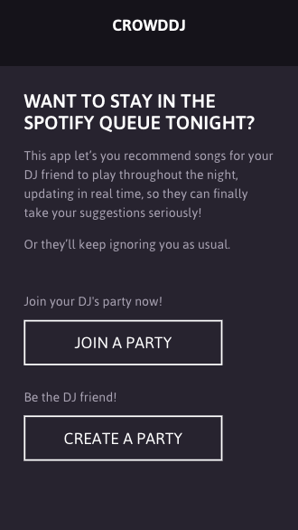
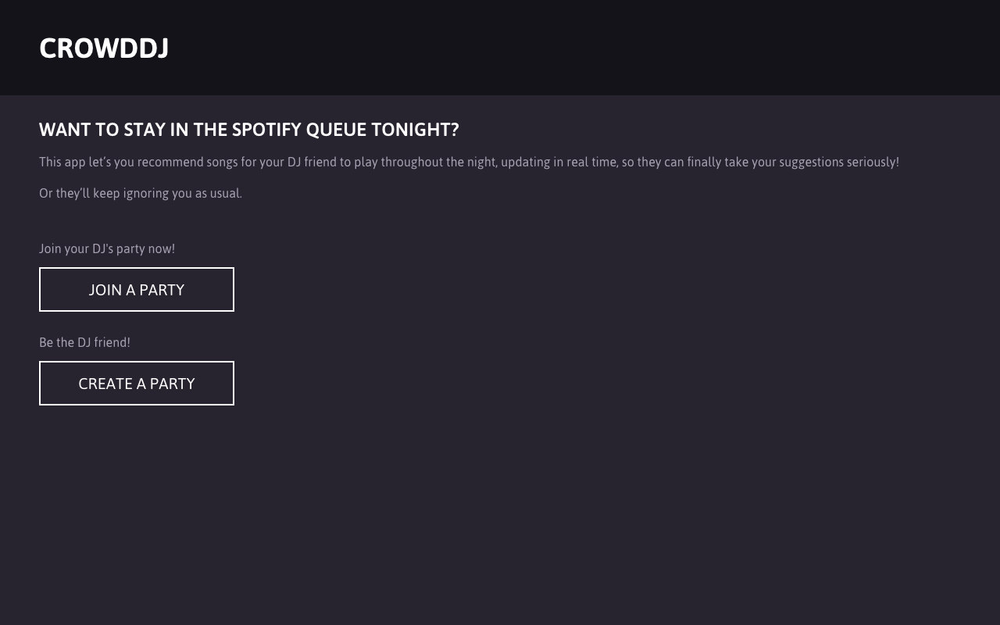
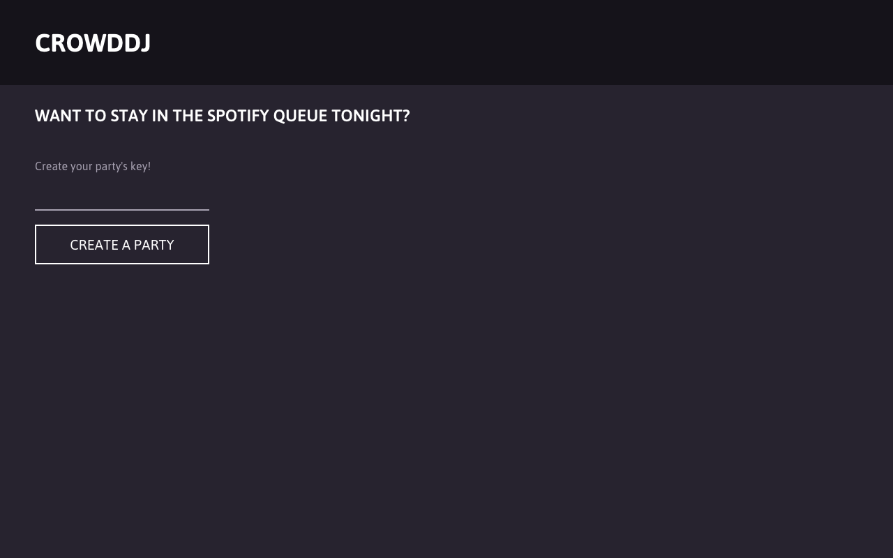
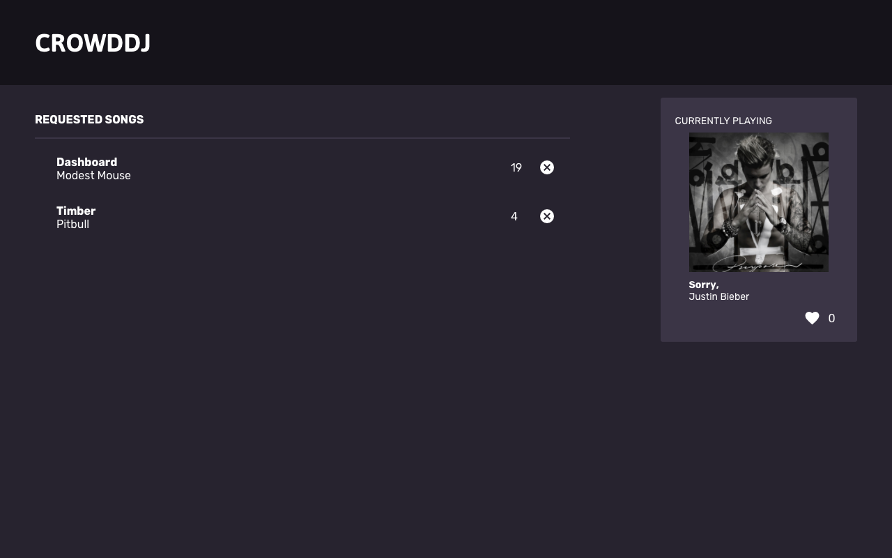

# Crowd DJ

**Crowd DJ won Best UI/Design at [Hackbeanpot 2017](https://hackbeanpot.com)**

Crowd DJ is a web app that allows people who are at a party or social gathering with a DJ (who uses Spotify) to request songs via their smartphones. The web app allows people to see the currently playing song, request songs, upvote songs, and rate songs so the DJ can see how the crowd is feeling and act accordingly. In other words, Crowd DJ is essentially a crowdsourced music queue.

**Contributors:** [@john4](https://github.com/john4) [@BenC14](https://github.com/BenC14) [@bchiang7](https://github.com/bchiang7) [@camden11](https://github.com/camden11) [@Drewpom](https://github.com/Drewpom)

Designs by Julie Tennett

## Dependencies
1. Node 6.5+
2. Yarn

## Setup
1. Clone the repo
```git clone git@github.com:crowddj/crowddj-react.git```

2. Install dependencies
```yarn install```

3. Build & Start the project
```yarn start```

## Tech Stack
- ReactJS
- Sass
- Firebase
  * We use Firebase to keep track of all our "Rooms" it holds our currently playing songs the average ratings of the songs as well as the suggested songs from out party listeners.
- Spotify API
  * Unfortunately Spotify's API does not support many useful feature like 'Get Song Queue' or 'Currently Playing'. In order to circumvent this problem we built Chrome Web Extension that scrapes the Spotify Web Player and uploads the relevant track data to our Firebase database. The Spotify API was primarily used for our live song search suggestions.

### Screenshots






